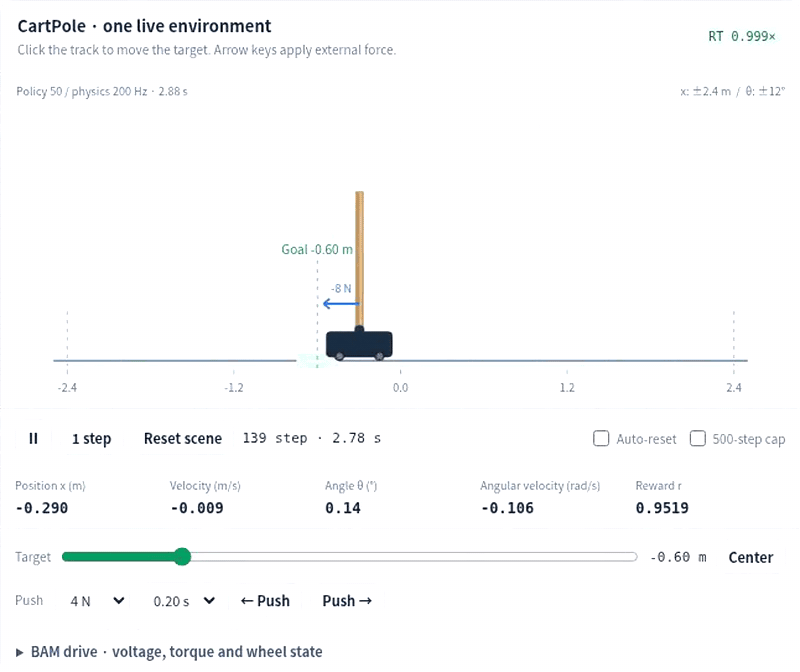

# CartPole PPO Studio

**Push the pole. Watch the controller respond. Follow one real decision into the network.**

**[Open interactive simulation →](https://tinmanlab.github.io/cartpole-ppo/?lang=en)** · **[한국어로 실행](https://tinmanlab.github.io/cartpole-ppo/index.html?lang=ko)** · [한국어 안내](README.ko.md)

One CartPole, five connected lessons, real PPO in your browser. No GPU, account, API key or learning backend. English and Korean share the same engine; switching language does not reset your experiment.

## Start with a question

| Your question | Try this |
|---|---|
| **Is the controller responding to my push?** | Hold a push button or ←/→. The force acts horizontally at the **pole tip**, only while held. Start with 0.1 N. Watch the control-step counter and **sensed state → Actor command → actual wheel force → response**. |
| **What does the network compute?** | **Inspect this live decision** pauses the scene and opens the forward pass. Click a neuron to inspect multiply, sum, bias and tanh. Chapters 3–4 instead follow a clearly labelled **recorded training experience** into GAE, gradients and Adam. |
| **Can I train a policy myself?** | Chapter 5 → **Start training**. Your learner starts at random I.0, independently of the pretrained opening example. Finish an iteration before freezing its policy for inference. |
| **What changes if I choose another motor, cost or disturbance?** | **Model · conditions** separates **test only**, **keep weights and configure continuation**, and **create a new learner**. Applying conditions is not starting training. |
| **Can I follow one real experience from input to update?** | Open **Follow one experience** next to the recorded-policy picker. It is read-only: the same GAE, ratio/clip/loss and before/after probability already used in chapters 3–4, for one immutable recorded sample, with its five inputs explicitly labelled as normalized/dimensionless, a signed advantage indicator, a signed before/after probability change in percentage points, one recorded Adam weight witness, and full ArrowLeft/Right/Home/End keyboard tab navigation. Changing the selected record or sample invalidates it until you recapture the current one. |

This viewer is part of a shared multi-repo teaching walkthrough; the canonical cross-repo design contract lives at `cartpole-transformer/docs/learning-suite.md`.

**Inference is not learning.** During a held push, the Actor still computes an action every 20 ms; its weights remain fixed unless the separate learner publishes a completed update. Release, focus loss, pause, reset or a physical/model stop clears held force. No hand-coded balancing controller is inserted.

**Tip force is not cart force.** A tip force also creates a moment. Existing training presets and scripted evaluations still apply **cart-body** disturbances; a manual tip push is test-only and is not sent to the learner. A 12 N tip test cannot inherit a 12 N cart-body recovery score. Strong loads can terminate the trial or exceed the no-slip/contact model; the visible stop reason distinguishes these cases.

[Tip-force contract and equations](docs/TIP_FORCE.md) · [Hands-on tutorial](docs/TUTORIAL.md) · [Model & limits](docs/MODEL.md)

## What is real here?

- **PPO:** 2,048-step rollouts, termination-aware GAE, clipped surrogate, entropy bonus, analytic backpropagation, minibatch means, gradient clipping and Adam. Actor `5→16→2`; Critic `5→16→1`.
- **Actuator-aware physics:** XL330, MX64 and MX106 use pinned [Rhoban/BAM](https://github.com/Rhoban/bam) M6 parameters and torque/friction equations through an explicitly separate wheel-drive adapter. An ideal-force reference remains available.
- **Repeatable experiments:** reward costs, mass/gearing, pushes, wind, noise, delay and parameter variation; fixed, ramped and success-gated curricula; optimizer checkpoints and stepwise recorded replay.
- **Inspectable numbers:** signed weights, activations and update deltas are different quantities. They are not green/red performance scores. The selected experience is preserved across the learning chapters.

The cart is a planar reduced-order model, not a full mobile robot. The wheel mesh is a dimensional reconstruction, not the original manufacturer STL. Slip after loss of traction, thermal protection, hardware watchdogs and real-device safety are not simulated. Real-time ratio is measured, not guaranteed on every computer. No all-disturbance or sim-to-real success claim is made.

## Earlier walkthrough

[](https://tinmanlab.github.io/cartpole-ppo/docs/demo.html)

**[Watch the earlier walkthrough](https://tinmanlab.github.io/cartpole-ppo/docs/demo.html).** This real recording predates held-tip input and shows timed cart-body pulses. It remains useful for the network/PPO lessons, but is **not** footage of the current interaction. Its exact English source is preserved in `archive/en/body-pulse.v2.html`; the previous Korean version remains in `archive/ko/`.

## Online, offline and verification

Use the live link above with no installation. To build an offline copy from a source checkout:

```bash
python src/build.py
# Open the generated index.html or viewer.ko.html in a desktop browser.
node tools/test.js
python src/build.py --check
python tools/check_package.py
```

Building needs only Python's standard library. Generated HTML entries are distribution artifacts, not a second editable source. Pages CI builds and checks both languages before publishing. Browser tests additionally require `requirements-dev.txt` and a Playwright-compatible browser.

[Hosting and live checks](docs/PAGES.md) · [Earlier engine verification](docs/VERIFICATION.md) · [Contributing](CONTRIBUTING.md) · [Third-party notices](THIRD_PARTY.md)

The hosted acceptance tests check the exact deployed revision, real pointer/key holds, continued inference, cancellation paths, a genuine PPO iteration, language round trips, replay, media playback and working shortcuts. Passing these checks is not a robustness or hardware certification.
